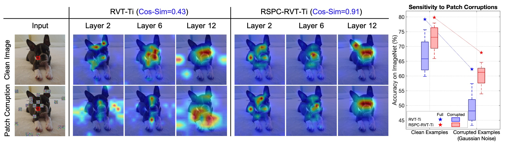

# Improving Robustness of Vision Transformers by Reducing Sensitivity to Patch Corruptions
[Yong Guo](http://www.guoyongcs.com/), [David Stutz](https://davidstutz.de/), and [Bernt Schiele](https://scholar.google.com/citations?user=z76PBfYAAAAJ&hl=en). CVPR 2023.

### [Paper](https://openaccess.thecvf.com/content/CVPR2023/papers/Guo_Improving_Robustness_of_Vision_Transformers_by_Reducing_Sensitivity_To_Patch_CVPR_2023_paper.pdf) | [Slides](https://www.guoyongcs.com/RSPC-Materials/RSPC.pdf) | [Poster](https://www.guoyongcs.com/RSPC-Materials/RSPC_Poster.pdf)


<p align="center">

</p>

This repository contains the official Pytorch implementation and the pretrained models of [Reducing Sensitivity to Patch Corruptions](https://openaccess.thecvf.com/content/CVPR2023/papers/Guo_Improving_Robustness_of_Vision_Transformers_by_Reducing_Sensitivity_To_Patch_CVPR_2023_paper.pdf) (**RSPC**).


## Catalog
- [x] Pre-trained Models on CIFAR
- [x] Pre-trained Models on ImageNet
- [x] Evaluation and Training Code


# Dependencies
Our code is built based on pytorch and timm library. Please check the detailed dependencies in [requirements.txt](requirements.txt).

# Dataset Preparation

- **CIFAR-10 and related robustness benchmarks**: Please download the clean [CIFAR-10](https://www.cs.toronto.edu/~kriz/cifar.html) and the corrupted benchmark [CIFAR-10-C](https://zenodo.org/record/2535967).

- **CIFAR-100 and related robustness benchmarks**: Please download the clean [CIFAR-100](https://www.cs.toronto.edu/~kriz/cifar.html) and the corrupted benchmark [CIFAR-100-C](https://zenodo.org/record/3555552).

- **ImageNet and related robustness benchmarks**: Please download the clean [ImageNet](http://image-net.org/) dataset. We evaluate the models on varisous robustness benchmarks, including [ImageNet-C](https://zenodo.org/record/2235448), [ImageNet-A](https://github.com/hendrycks/natural-adv-examples), and [ImageNet-P](https://zenodo.org/record/3565846).


## Results and Pre-trained Models

### Pre-trained models on CIFAR-10 and CIFAR-100

- Pre-trained models on CIFAR-10 and CIFAR-10-C

|       Model       | CIFAR-10  | CIFAR-10-C | #Params |                                             Download                                             |
|:-----------------:|:---------:|:----------:|:-------:|:------------------------------------------------------------------------------------------------:|
|    RSPC-RVT-S     |   97.73   |   94.14    |  23.0M  | [model](https://github.com/guoyongcs/RSPC/releases/download/v1.1/rspc_rvt_small_cifar10.pth.tar) |
| RSPC-FAN-S-Hybrid | **98.06** | **94.59**  |  25.7M  | [model](https://github.com/guoyongcs/RSPC/releases/download/v1.1/rspc_fan_small_cifar10.pth.tar) |

- Pre-trained models on CIFAR-100 and CIFAR-100-C

|       Model       | CIFAR-100 | CIFAR-100-C | #Params |                                              Download                                              |
|:-----------------:|:---------:|:-----------:|:-------:|:--------------------------------------------------------------------------------------------------:|
|    RSPC-RVT-S     |   84.81   |    74.94    |    23.0M    | [model](https://github.com/guoyongcs/RSPC/releases/download/v1.1/rspc_rvt_small_cifar100.pth.tar)  |
| RSPC-FAN-S-Hybrid | **85.30** |  **75.72**  |  25.7M  | [model](https://github.com/guoyongcs/RSPC/releases/download/v1.1/rspc_fan_small_cifar100.pth.tar)  |

### ImageNet-1K pre-trained models

- RSPC-RVT pre-trained models

|       Model       | IN-1K $\uparrow$ | IN-C $\downarrow$ | IN-A $\uparrow$ | IN-P $\downarrow$ | #Params |                                                                                Download                                                                                |
|:-----------------:|:----------------:|:-----------------:|:---------------:|:-----------------:|:-------:|:----------------------------------------------------------------------------------------------------------------------------------------------------------------------:|
|    RSPC-RVT-Ti    |       79.5       |       55.7        |      16.5       |       38.0        |    10.9M    |                                        [model](https://github.com/guoyongcs/RSPC/releases/download/v1.0/rspc_rvt_tiny.pth.tar)                                         |
|    RSPC-RVT-S     |       82.2       |       48.4        |      27.9       |       34.3        |  23.3M  |                                        [model](https://github.com/guoyongcs/RSPC/releases/download/v1.0/rspc_rvt_small.pth.tar)                                        |
|    RSPC-RVT-B     |     **82.8**     |     **45.7**      |    **32.1**     |     **31.0**      |  91.8M  |                                        [model](https://github.com/guoyongcs/RSPC/releases/download/v1.0/rspc_rvt_base.pth.tar)                                         |


- RSPC-FAN pre-trained models

|       Model       | IN-1K $\uparrow$ | IN-C $\downarrow$ | IN-A $\uparrow$ | IN-P $\downarrow$ | #Params |                                         Download                                         |
|:-----------------:|:----------------:|:-----------------:|:---------------:|:-----------------:|:-------:|:----------------------------------------------------------------------------------------:|
| RSPC-FAN-T-Hybrid |       80.3       |       57.2        |      23.6       |       37.3        |    7.5M    | [model](https://github.com/guoyongcs/RSPC/releases/download/v1.0/rspc_fan_tiny.pth.tar)  |
| RSPC-FAN-S-Hybrid |       83.6       |       47.5        |      36.8       |       33.5        |  25.7M  | [model](https://github.com/guoyongcs/RSPC/releases/download/v1.0/rspc_fan_small.pth.tar) |
|  RSPC-FAN-B-ViT   |     **84.2**     |     **44.5**      |    **41.1**     |     **30.0**      |  50.5M  | [model](https://github.com/guoyongcs/RSPC/releases/download/v1.0/rspc_fan_base.pth.tar)  |


## Training and Evaluation
 - CIFAR-10 and CIFAR-100: Please refer to [EXP_CIFAR](EXP_CIFAR).

 - RSPC-RVT on ImageNet-K: Please refer to [RSPC_RVT](RSPC_RVT).

 - RSPC-FAN on ImageNet-1K: Please refer to [RSPC_FAN](RSPC_FAN).


## Acknowledgement
This repository is built using the [timm](https://github.com/rwightman/pytorch-image-models) library, [RVT](https://github.com/vtddggg/Robust-Vision-Transformer), and [FAN](https://github.com/NVlabs/FAN) repositories.

## Citation
If you find this repository helpful, please consider citing:
```
@inproceedings{guo2023improving,
  title={Improving robustness of vision transformers by reducing sensitivity to patch corruptions},
  author={Guo, Yong and Stutz, David and Schiele, Bernt},
  booktitle={Proceedings of the IEEE/CVF Conference on Computer Vision and Pattern Recognition},
  pages={4108--4118},
  year={2023}
}
```


